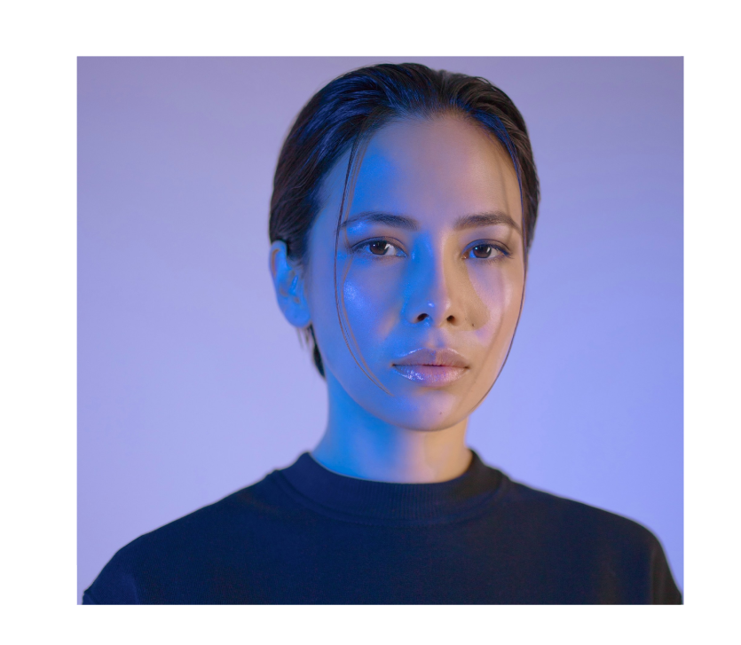

# uploaded-figma

This project was created using Figma. It showcases a design exported and uploaded to GitHub.

## Note

In this project, I used the **"Use as Mask"** feature in Figma.  
This technique allows parts of an image or shape to be hidden or revealed based on a mask object.  
It is useful for creating creative and professional designs easily.

## Preview

## Figma Link

[Figma Project Link](https://www.figma.com/design/0MPzivObRQhXLQ899BBRYI/Figma-First-Project?node-id=109-20&t=pSmfONhFWO0uvl9o-1)
